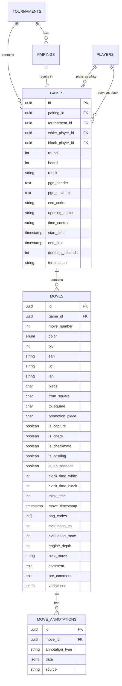

# Enhanced Moves Table Architecture

## Overview

The enhanced moves table system provides comprehensive chess game data storage with support for multiple notation formats, timing information, evaluations, and annotations.

## Database Schema



## Key Features

### 1. Multiple Notation Support

- **SAN (Standard Algebraic Notation)**: e4, Nf3, O-O
- **UCI (Universal Chess Interface)**: e2e4, g1f3, e1g1
- **LAN (Long Algebraic Notation)**: e2-e4, Ng1-f3, O-O

### 2. Rich Move Metadata

- **Timing Information**
  - Clock times for both players
  - Think time per move
  - Move timestamps for replay

- **Position Evaluation**
  - Engine evaluation in centipawns
  - Mate-in-X detection
  - Best move suggestions
  - Analysis depth

- **Special Moves**
  - Castling (kingside/queenside)
  - En passant captures
  - Pawn promotions
  - Check/checkmate flags

### 3. Annotations System

- **NAG Codes**: Standard chess annotation symbols (!, ?, !!, ??, !?, ?!)
- **Comments**: Pre-move and post-move comments
- **Variations**: Alternative move sequences in JSONB format
- **External Annotations**: Engine lines, book references, historical games

### 4. Performance Optimizations

- Composite indexes for game+ply lookups
- Separate indexes for notation searches
- Evaluation range queries
- Tournament/round filtering
- Position search capabilities

## Implementation Status

✅ **Completed**:
- Database schema (Prisma)
- SQL migrations
- Move notation converter utility
- Type definitions

🔄 **In Progress**:
- PGN parser service
- API endpoints
- Performance indexes
- Game analysis integration

## Usage Examples

### Storing a Move

```typescript
const move: ChessMove = {
  gameId: "game-uuid",
  moveNumber: 1,
  color: 'white',
  ply: 1,
  san: "e4",
  uci: "e2e4",
  lan: "e2-e4",
  piece: "P",
  fromSquare: "e2",
  toSquare: "e4",
  isCapture: false,
  isCheck: false,
  isCheckmate: false,
  isCastling: false,
  isEnPassant: false,
  clockTimeWhite: 7200,
  clockTimeBlack: 7200,
  thinkTime: 5,
  moveTimestamp: new Date()
};
```

### Converting Notations

```typescript
import { MoveNotationConverter } from '@/lib/utils/move-notation-converter';

// Convert UCI to SAN
const san = MoveNotationConverter.uciToSan("e2e4", position);

// Convert SAN to UCI
const uci = MoveNotationConverter.sanToUci("Nf3", position);
```

### Querying Moves

```sql
-- Get all moves for a game in order
SELECT * FROM moves 
WHERE game_id = 'game-uuid' 
ORDER BY ply;

-- Find all games with a specific opening
SELECT g.* FROM games g
WHERE g.eco_code = 'B90'  -- Najdorf Sicilian
ORDER BY g.created_at DESC;

-- Get moves with engine evaluation
SELECT * FROM moves
WHERE game_id = 'game-uuid'
  AND evaluation_cp IS NOT NULL
ORDER BY ply;
```

## Next Steps

1. **PGN Parser**: Implement robust PGN parsing with error handling
2. **API Endpoints**: Create RESTful endpoints for move operations
3. **Real-time Updates**: Integrate with SSE for live game updates
4. **Analysis Queue**: Implement background job for engine analysis
5. **Move Validation**: Add chess rules validation before storing moves